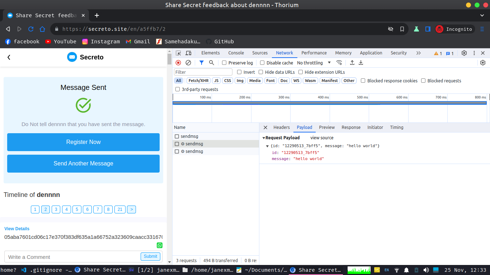

secreto-spam is tool for spamming anonymous message to secreto user using random string from node crypto

## installation

```
npm install
```

## how to get user id secreto

- send message to target using broswer, and see network tab
  

## how to run

```
node index.js
```

or

```
npm run start
```
